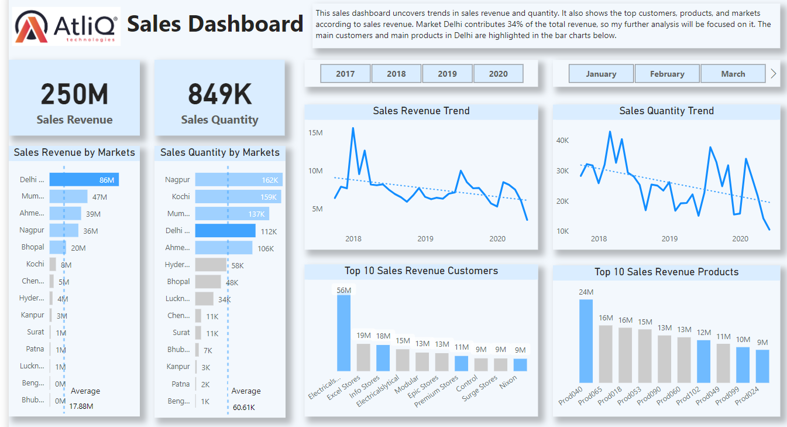

#  Product Sales Insight - AtliQ Hardware

## Table of Contents
- [Technologies](#technologies)
- [Business Intelligence](#business-intelligence)
    - [Problem](#the-problem)
    - [Solution](#the-solution)
    - [Results](#results)
- [Project Planning](#Project-Planning)
- [Data Processing](#data-processing)
    - [Data Examing](#data-examing)
    - [Data Quality Report](#data-quality-report)
    - [Data Analysis](#data-analysis)
- [ETL](#etl-extract-transform-load)
- [Data Modeling](#data-modeling)
- [DAX: Metrics Build](#dax-metrics-build)
- [Dashboard](#dashboard)
- [Report](#report)
- [References](#references)
## Technologies

1. MySQL: Data Analysis

2. Microsoft Power BI: ETL (Extract, Transformation, and Load), data visualiztion

3. Power Query Editor

4. DAX Language 

5. Business Intelligence: Problem-solving, report generation
## Business Intelligence

AtliQ Hardware is a company which supplies computer hardware and peripherals to many clients. Sales directors at this company have amounts of customer transaction data to manage, and that's where the problem comes in!

- ### The problem

The company has experienced the sales decrease in recent years. The sales director consults with the BI team to consider how to approach two concerns:

- How is the sales performance based on historical records?

- Why has the company has sales decreased in recent years?

However, these stakeholders currently don't have metrics in place to specifically measure the sales performance or strategies, and this is where I will start to do my work.

- ### The solution

To address the stakeholder's needs, I gathered data from [database](https://codebasics.io/resources/sales-insights-data-analysis-project). I found that the following metrics have already been applied:

- Sales quantity

- Revenue

By comparing the existing metrics, the company can understand the sales insights well. However, I would like to consider more metrics about sales performance to understand customer behaviour behind the sales decrease. The questions I put forward to help myself think further:

- Did customers purchase the same amount of values as before?

- Did customers visit as frequently as before?

- Which products contribute to the revenue most and how is their sales performance?

These metrics help the company to explore the reasons for sales decrease behind the customer behaviour. I then organize this data within the database systems and load it to visualization software to generate the dashboard and report for stakeholders to consider as they strategize how to increase sales performance.

- ### Results

It was discovered that the overall customer purchasing power has decreased heavily, and customers stopped purchasing one product (the type which is cheap with large quantities) since September 2018. Customers purchasing behaviour has changed to purchasing products which are expensive with small quantities. It is suggested that the sales directors should gather more information related to external market to understand the reasons for changes in customer behaviour.
## Project Planning


Reference: [@codebasics](https://www.youtube.com/watch?v=9QiZ0-HZG_A&list=PLeo1K3hjS3uva8pk1FI3iK9kCOKQdz1I9&index=2&ab_channel=codebasics)
## Data Processing

First, I used MySQL to get a general view of the whole database and generate the data quality report for reference. The key points I will be focusing on include data types, count of rows, entries of categorical values, range of numerical values, incorrect values, null values, and so on.

### Data Examing

- Check the data types and Null values for tables
   
    ```
    USE sales;

    DESCRIBE transactions;

    SELECT * FROM markets 
    WHERE zone = '';
    ```

- Check the counts of the rows for tables

    ```
    SELECT COUNT(*) FROM transactions;
    ```

 - Check data integrity for categorical columns
    
    ```
    SELECT 
        COUNT(DISTINCT product_code) AS products_in_transactions
    FROM transactions;

    SELECT 
        COUNT(DISTINCT product_code) AS products_listed
    FROM products;
    ```

- Check distinct values for categorical column

    ```
    SELECT 
        DISTINCT currency 
    FROM transactions;
    ```

- Checked the time period for DATE column

    ```
    SELECT 
        MIN(order_date), 
        MAX(order_date) 
    FROM transactions;
    ```

- Check data range for numerical columns

    ```
    SELECT 
        COUNT(sales_amount)
    FROM transactions 
    WHERE sales_amount <= 0;
    ```

### Data Quality Report

- Lack of data in `product_code`

    I found there are 279 product codes in `product` reference table whilst 339 in `transaction` table. The null value will be generated if I try to JOIN two tables in the future

    Suggestion: Gather more information for `product` reference table to ensure data integrity or remove the null product in the following analysis

- Different currecies `INR` and `USD`

    Column `Currency` contains two different currencies, `INR` and `USD`. It also contains typos, `INR ` and `USD `

    Suggestion: Data transformation. Re-calculate the sales amount according to `INR` to unify the currency, and correct the typos

- Negative values in `sales_amount`

    Column `sales_amount` in table `transaction` contains negative values, which are incorrect

    Suggestions: Delete the rows with negative sales amounts

- Lack of data in Year `2017` and `2020`

    The database only contains data from Oct 2017 to June 2020

    Suggestions: Gather more data in Year 2017 and 2020 or analyze the existing data, but ensure to consider the factor of imcomplete data

- Redundant data in `market_names`

    Table `markets` include redundant market information `New York` and `Paris` which will not be considered in this analysis

    Suggestions: Delete the rows

### Data Analysis

The following codes present tables to answer the questions I put forward in the section [Business Intelligence](#the-solution)

- Check the yearly total revenue and sales quantity for each customer

    ```
    SELECT 
        customer_code, 
        YEAR(order_date) AS year, 
        SUM(sales_amount)AS total_sales_amount, 
        SUM(sales_qty) AS total_sales_qty
    FROM transactions
    GROUP BY 
        customer_code, YEAR(order_date)
    ORDER BY 
        customer_code;
    ```

- Count transaction times every year for each customer

    ```
    SELECT 
        c.custmer_name, 
        YEAR(t.order_date) AS year, 
        COUNT(*) AS transaction_times
    FROM transactions AS t
    LEFT JOIN 
        customers AS c ON c.customer_code = t.customer_code
    GROUP BY 
        t.customer_code, YEAR(t.order_date)
    ORDER BY 
        c.custmer_name;
    ```

- Count the total number of customers every year

    ```
    SELECT 
        YEAR(order_date) AS year, 
        COUNT(*) AS transaction_times
    FROM transactions
    GROUP BY 
        YEAR(order_date);
    ```
## ETL (Extract, Transform, Load)

In this step, data is extracted from SQL server, then is transformed with Power Query, and finally is is loaded to Power BI model. Based on the data quality report, the following transformations were implemented.

- Correct the typos `USD ` and `INR `

    ```
    /* Clean the text */
    = Table.TransformColumns(#"Removed Errors",{{"currency", Text.Clean, type text}})
    ```

- Calculate the sales amount in `INR`

    ```
    /* Creat a conditional column 'USD sales amount' where shows the USD sales amounts as original numbers, and INR sales amounts as 0 */
    = Table.AddColumn(#"Cleaned Text", "USD_sales_amount", each if [currency] = "USD" then [sales_amount] else 0)

    /* Multiply the new column by the currency ratio, 83.3 */
    = Table.AddColumn(#"Added Conditional Column", "INR_sales_amount", each [USD_sales_amount]*83.3)

    /* Create the conditional column which contains the correct INR sales amount*/
    = Table.AddColumn(#"Added Custom", "sales_amount_updated", each if [currency] = "INR" then [sales_amount] else if [currency] = "USD" then [INR sales amount] else null)
    ```

- Delete the non-positive values in `sales_amount`

    ```
    = Table.SelectRows(#"Renamed Columns", each [sales_amount] >= 0)
    ```

- Delete the redundant values in `market_name`

    ```
    /* Delete the markets names of New York and Paris */
    = Table.SelectRows(#"Changed Type1", each ([markets_name] <> "New York" and [markets_name] <> "Paris"))
    ```
## Data Modeling


## DAX: Metrics Build

- Total Number of Customers

    ```
    TotalNumberofCustomers = CALCULATE(COUNTROWS(VALUES('transactions'[customer_code])))
    ```

- Sales Quantity Per Customer

    ```
    SalesQuantityPerCustomer = DIVIDE(SUM('transactions'[sales_qty]), 'transactions'[TotalNumberofCustomers])
    ```

- Total Number of Transactions

    ```
    TransactionCount = CALCULATE(COUNTROWS('transactions'))
    ```

- Number of Transactions Per Customer

    ```
    TransactionCountsPerCustomer = DIVIDE('transactions'[TransactionCount], 'transactions'[TotalNumberofCustomers])
    ```

- Sales Revenue Per Customer

    ```
    RevenuePerCustomer = DIVIDE(SUM('transactions'[sales_amount]), 'transactions'[TotalNumberofCustomers],0)
    ```

- Sales Quantity Growth Rate

    ```
    Q2017Jan = CALCULATE(SUM('transactions'[sales_qty]), 'date'[year] = 2018, 'date'[month_name] = "January")

    Q2020June = CALCULATE(SUM('transactions'[sales_qty]), 'date'[year] = 2020, 'date'[month_name] = "June")

    QGrowth = DIVIDE([Q2020June] - [Q2017Jan], [Q2017Jan], 0)
    ```

- Sales Revenue Growth Rate

    ```
    R2017Jan = CALCULATE(SUM('transactions'[sales_amount]), 'date'[year] = 2018, 'date'[month_name] = "January")

    R2020June = CALCULATE(SUM('transactions'[sales_amount]), 'date'[year] = 2020, 'date'[month_name] = "June")

    RGrowth = DIVIDE([R2020June] - [R2017Jan], [R2017Jan], 0)
    ```
## Dashboard

|Sales Insight|
|-------------|
||

|Reason discovering for sales decrease|
|-------------|
||
## Report

There are two key insights I discovered to explain the reasons behind the sales decrease. The analysis focuses on the main market, `Delhi NCR`, which contributes 34.2% to total sales revenue. `Electricalsara Store` is the main customer in this market with £56M revenue and main products `prod40`, `prod102`, and `prod99`.

1. Customers' purchasing power is decreasing

Purchasing power is measured by two metrics: number of transactions per customer, and sales quantity per customer. For customer `Electricalsara Store`, the first metric has decreased by 149.3% and the second one has decreased by 252.4% from Jan 2028 to June 2020.

To further dig into the reason for the decrease in purchasing power, I checked the customer churn rate. Although in the market `Delhi NCR` there is a total of 4 customers, which is a small amount compared to other markets, it possesses a 100% customer repeat rate. `Delhi NCR` has perfect customer loyalty.

Therefore, this decrease in purchasing power could be related to external reasons such as market changes to certain products.

2. Customers stopped purchasing `prod99`

There are three main products, `prod40`, `prod102`, and `prod99`, and they are different product types. The sales quantity of `prod99` is twice more as the other products whilst the revenue is around half than other two. However, the purchase of this product stopped in September 2018, which generated £10M during its selling period.

Therefore, the main products sold shift to the type which can generate high revenue with small amounts, like `prod102` and `prod40`. However, the purchasing power of these two products is also decreasing, which has a -52.8% and -94.4% growth rate in sales revenue.

In conclusion, the decrease in customers' purchasing power leads to the sales decrease. It is suggested that sales directors should gather more data related to the external market to analyze further the exact reasons.
## References
[@codebasics](https://codebasics.io/panel/webinars/purchases)